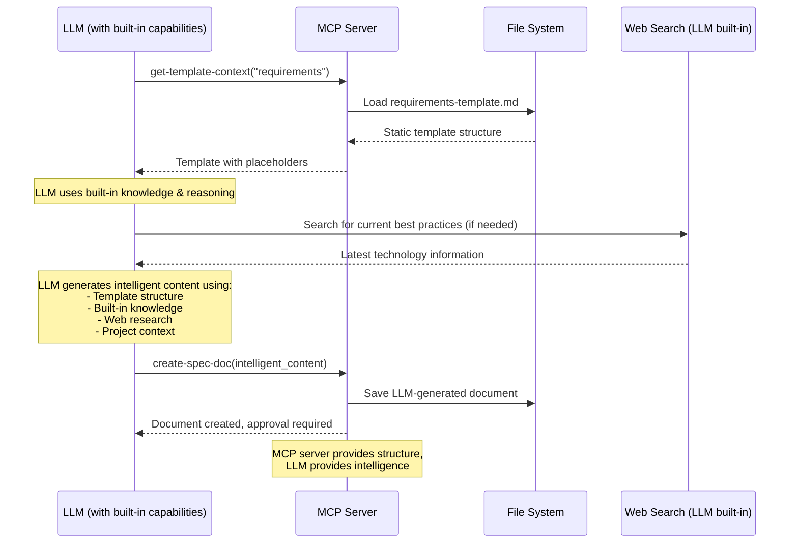

# MCP Tools API Reference

> **Quick Nav**: [Workflow Tools](#workflow-tools) | [Content Tools](#content-tools) | [Search Tools](#search-tools) | [Status Tools](#status-tools) | [Approval Tools](#approval-tools)

## 📋 Tool Categories

| Category | Tools | Purpose |
|----------|-------|---------|
| **Workflow** | `spec-workflow-guide`, `steering-guide` | Provide workflow instructions |
| **Content** | `create-spec-doc`, `create-steering-doc`, `get-template-context` | Create and template documents |
| **Search** | `get-spec-context`, `get-steering-context`, `spec-list` | Find and load existing content |
| **Status** | `spec-status`, `manage-tasks`, `refresh-tasks` | Track progress |
| **Approval** | `request-approval`, `get-approval-status`, `delete-approval` | Manage approval workflow |

## 🔄 Workflow Tools

### `spec-workflow-guide`

**Purpose**: Load complete workflow instructions for spec-driven development

**Usage**: Call FIRST when users request spec creation or feature development

```typescript
// Parameters: None
{}

// Response
{
  success: true,
  message: "Complete spec workflow guide loaded - follow this workflow exactly",
  data: {
    guide: "# Spec Development Workflow...",
    dashboardUrl?: string,
    dashboardAvailable: boolean
  },
  nextSteps: [
    "Follow sequence: Requirements → Design → Tasks → Implementation",
    "Load templates with get-template-context first",
    "Request approval after each document"
  ]
}
```

**Workflow Sequence**:
1. Requirements Phase → 2. Design Phase → 3. Tasks Phase → 4. Implementation Phase

**Key Rules**:
- ✅ Always use MCP tools, never manual document creation
- ✅ Get explicit approval between each phase
- ✅ Complete phases in sequence (no skipping)
- ❌ Never proceed on verbal approval - dashboard/VS Code only

**Planning Process Architecture**:
- ✅ **Template-Based Structure**: Uses static templates from `/src/markdown/templates/`
- ✅ **LLM-Powered Content Generation**: Connected LLM uses its built-in capabilities to fill templates
- ✅ **LLM Built-in Knowledge**: LLM applies software engineering best practices using its training
- ✅ **LLM Web Research**: LLM can perform web searches for current technologies and practices
- ✅ **Workflow Validation**: Server enforces proper sequence and structure
- ✅ **Human Review Required**: All LLM-generated content requires dashboard/VS Code approval

**Content Generation Flow**:


---

### `steering-guide`

**Purpose**: Load instructions for creating project steering documents

**Usage**: Call when establishing project guidelines or architectural context

```typescript
// Parameters: None
{}

// Response
{
  success: true,
  message: "Steering guide loaded successfully",
  data: {
    guide: "# Steering Documents Guide...",
    dashboardUrl?: string
  }
}
```

**Steering Document Types**:
- **product.md**: Product vision and requirements
- **tech.md**: Technical standards and architecture decisions  
- **structure.md**: Code organization and file structure

## 📝 Content Tools

### `create-spec-doc`

**Purpose**: Create or update specification documents following workflow sequence

**Usage**: Call AFTER loading templates and generating content for each phase

```typescript
// Parameters
{
  projectPath: "/absolute/path/to/project",
  specName: "user-authentication",     // kebab-case only
  document: "requirements",            // "requirements" | "design" | "tasks" 
  content: "# Requirements Document\n..." // Complete markdown content
}

// Response
{
  success: true,
  message: "Created requirements.md at: .spec-workflow/specs/user-authentication/requirements.md\n\nBLOCKING: Must request approval via dashboard or VS Code extension.",
  data: {
    specName: "user-authentication",
    document: "requirements",
    filePath: ".spec-workflow/specs/user-authentication/requirements.md"
  }
}
```

**Workflow Enforcement**:
- ❌ Cannot create `design.md` without `requirements.md`
- ❌ Cannot create `tasks.md` without `design.md`
- ✅ Auto-creates `.spec-workflow/specs/` directory structure

**Next Step**: Always call `request-approval` immediately after creation

---

### `create-steering-doc`

**Purpose**: Create project steering documents for architectural guidance

```typescript
// Parameters
{
  projectPath: "/absolute/path/to/project",
  document: "product",                 // "product" | "tech" | "structure"
  content: "# Product Vision\n..."     // Complete markdown content
}

// Response  
{
  success: true,
  message: "Created product.md at: .spec-workflow/steering/product.md",
  data: {
    document: "product",
    filePath: ".spec-workflow/steering/product.md"
  }
}
```

---

### `get-template-context`

**Purpose**: Load specific document templates with proper formatting

**Usage**: Call with exact template needed for current phase

```typescript
// Parameters
{
  projectPath: "/absolute/path/to/project",
  templateType: "spec",                // "spec" | "steering"
  template: "requirements"             // See template options below
}

// Response
{
  success: true,
  message: "Loaded requirements template for spec",
  data: {
    context: "## Requirements Template\n\n[Template content...]",
    templateType: "spec",
    template: "requirements",
    loaded: "requirements-template.md"
  },
  nextSteps: [
    "Use template for requirements document",
    "Follow template structure exactly",
    "Next: create-spec-doc with document: \"requirements\""
  ]
}
```

**Template Options**:

| templateType | Available templates |
|--------------|-------------------|
| `spec` | `requirements`, `design`, `tasks` |
| `steering` | `product`, `tech`, `structure` |

## 🔍 Search Tools

### `get-spec-context`

**Purpose**: Load existing specification documents for resumed work

**Usage**: Call ONLY when returning to work on existing specs after a break

```typescript
// Parameters
{
  projectPath: "/absolute/path/to/project",
  specName: "user-authentication"
}

// Response - Success
{
  success: true,
  message: "Specification context loaded successfully for: user-authentication",
  data: {
    context: "## Specification Context (Pre-loaded): user-authentication\n\n### Requirements\n[content]\n\n### Design\n[content]\n\n### Tasks\n[content]",
    specName: "user-authentication",
    documents: {
      requirements: true,
      design: true, 
      tasks: false
    },
    sections: 2,
    specPath: "/project/.spec-workflow/specs/user-authentication"
  }
}

// Response - Not Found
{
  success: false,
  message: "No specification found for: user-authentication",
  data: {
    availableSpecs: ["login-system", "payment-flow"],
    suggestedSpecs: ["login-system", "payment-flow"]
  },
  nextSteps: [
    "Available specs: login-system, payment-flow",
    "Use an existing spec name",
    "Or create new with create-spec-doc"
  ]
}
```

**Important**: Documents are pre-loaded in response. Do not call `get-content` again.

---

### `get-steering-context`

**Purpose**: Load project steering documents for architectural context

**Usage**: Call during initial spec setup to check for existing project guidelines

```typescript
// Parameters
{
  projectPath: "/absolute/path/to/project"
}

// Response - Documents Found
{
  success: true,
  message: "Steering context loaded successfully",
  data: {
    context: "## Steering Documents Context (Pre-loaded)\n\n### Product Context\n[content]\n\n### Technology Context\n[content]",
    documents: {
      product: true,
      tech: true,
      structure: false
    },
    sections: 2
  },
  nextSteps: [
    "Steering context loaded - do not call get-steering-context again",
    "Reference these standards in requirements, design, and tasks"
  ]
}

// Response - No Documents  
{
  success: true,
  message: "No steering documents found",
  data: {
    context: "## Steering Documents Context\n\nNo steering documents found. Proceed using best practices for the detected technology stack.",
    documents: { product: false, tech: false, structure: false }
  },
  nextSteps: [
    "Use best practices and conventions for the detected technology stack",
    "For established codebases: Ask user if they want to create steering documents"
  ]
}
```

---

### `spec-list`

**Purpose**: List all specifications in the project with status information

**Usage**: Call to see available specs before selecting one to work on

```typescript
// Parameters
{
  projectPath: "/absolute/path/to/project"
}

// Response
{
  success: true,
  message: "Found 3 specifications",
  data: {
    specs: [
      {
        name: "user-authentication",
        description: "User login and registration system",
        status: "ready-for-implementation",  // Status options below
        phases: {
          requirements: true,
          design: true,
          tasks: true,
          implementation: false
        },
        taskProgress: {
          total: 8,
          completed: 0,
          inProgress: 0,
          pending: 8
        },
        lastModified: "2024-01-15T10:30:00Z",
        createdAt: "2024-01-10T09:00:00Z"
      }
    ],
    total: 3,
    summary: {
      byStatus: {
        "ready-for-implementation": 2,
        "in-progress": 1
      },
      totalTasks: 24,
      completedTasks: 8
    }
  }
}
```

**Status Values**:
- `not-started`: No documents created
- `in-progress`: Some phases incomplete
- `ready-for-implementation`: All phases approved
- `implementing`: Implementation in progress
- `completed`: All tasks finished

## 📊 Status Tools

### `spec-status`

**Purpose**: Get detailed status of a specific specification

```typescript
// Parameters
{
  projectPath: "/absolute/path/to/project",
  specName: "user-authentication"
}

// Response
{
  success: true,
  message: "Specification status retrieved successfully",
  data: {
    name: "user-authentication",
    status: "ready-for-implementation",
    phases: {
      requirements: { exists: true, approved: true },
      design: { exists: true, approved: true },
      tasks: { exists: true, approved: true },
      implementation: { exists: false, approved: false }
    },
    taskProgress: {
      total: 8,
      completed: 0,
      inProgress: 0,
      pending: 8
    },
    nextActions: [
      "Start implementation with first task",
      "Use manage-tasks to track progress"
    ]
  }
}
```

---

### `manage-tasks`

**Purpose**: Track and update task implementation progress

**Usage**: Call during implementation phase only

```typescript
// List all tasks
{
  projectPath: "/absolute/path/to/project",
  specName: "user-authentication",
  action: "list"
}

// Get specific task
{
  projectPath: "/absolute/path/to/project", 
  specName: "user-authentication",
  action: "get",
  taskId: "1.1"
}

// Update task status - CRITICAL SEQUENCE
{
  projectPath: "/absolute/path/to/project",
  specName: "user-authentication", 
  action: "set-status",
  taskId: "1.1",
  status: "in-progress"        // "pending" | "in-progress" | "completed"
}

// Get next pending task
{
  projectPath: "/absolute/path/to/project",
  specName: "user-authentication",
  action: "next-pending"
}
```

**Implementation Sequence**:
1. `set-status` → `"in-progress"` BEFORE writing code
2. Write and test the code  
3. `set-status` → `"completed"` AFTER implementation

**Response Examples**:
```typescript
// List response
{
  success: true,
  message: "Found 8 tasks (0 completed, 1 in-progress, 7 pending)",
  data: {
    tasks: [
      {
        id: "1.1",
        title: "Create User model",
        description: "Implement user data model with validation",
        status: "in-progress",
        files: ["src/models/User.ts"],
        requirements: ["REQ-1", "REQ-2"]
      }
    ],
    summary: { total: 8, completed: 0, inProgress: 1, pending: 7 }
  }
}

// Next pending response
{
  success: true,
  message: "Next pending task found",
  data: {
    task: {
      id: "1.2", 
      title: "Create authentication service",
      status: "pending"
    }
  },
  nextSteps: [
    "Set status to in-progress before starting",
    "Implement the task",  
    "Set status to completed when done"
  ]
}
```

---

### `refresh-tasks`

**Purpose**: Update and refresh task status from tasks.md file

```typescript
// Parameters
{
  projectPath: "/absolute/path/to/project",
  specName: "user-authentication"
}

// Response
{
  success: true,
  message: "Tasks refreshed successfully",
  data: {
    updated: true,
    taskCount: 8,
    summary: { total: 8, completed: 2, inProgress: 1, pending: 5 }
  }
}
```

## ✅ Approval Tools

### `request-approval`

**Purpose**: Request user approval through dashboard interface

**Usage**: Call IMMEDIATELY after creating each document

```typescript
// Parameters
{
  projectPath: "/absolute/path/to/project",
  title: "Requirements Document Review",
  filePath: ".spec-workflow/specs/user-auth/requirements.md",  // Relative to project root
  type: "document",                    // "document" | "action"
  category: "spec",                    // "spec" | "steering" 
  categoryName: "user-auth"           // Spec name or "steering"
}

// Response
{
  success: true,
  message: "Approval request created successfully. Please review in dashboard: http://localhost:3456",
  data: {
    approvalId: "user-auth-requirements-20241215-143022",
    title: "Requirements Document Review",
    filePath: ".spec-workflow/specs/user-auth/requirements.md",
    status: "pending",
    dashboardUrl: "http://localhost:3456"
  },
  nextSteps: [
    "BLOCKING - Dashboard or VS Code extension approval required",
    "VERBAL APPROVAL NOT ACCEPTED", 
    "Poll status with: get-approval-status \"user-auth-requirements-20241215-143022\""
  ]
}
```

**Critical Rules**:
- ❌ **Never include document content** - only provide `filePath`
- ❌ **Verbal approval not accepted** - dashboard/VS Code only
- ✅ **Wait for explicit approval** before proceeding

---

### `get-approval-status`

**Purpose**: Check the status of a pending approval request

**Usage**: Poll until approved or needs revision

```typescript
// Parameters  
{
  projectPath: "/absolute/path/to/project",
  approvalId: "user-auth-requirements-20241215-143022"
}

// Response - Pending
{
  success: true,
  message: "Approval status retrieved",
  data: {
    status: "pending",
    approvalId: "user-auth-requirements-20241215-143022",
    createdAt: "2024-12-15T14:30:22Z"
  },
  nextSteps: ["Continue polling until status changes"]
}

// Response - Approved
{
  success: true,  
  message: "Approval status retrieved",
  data: {
    status: "approved",
    approvalId: "user-auth-requirements-20241215-143022",
    approvedAt: "2024-12-15T14:35:10Z"
  },
  nextSteps: ["Delete approval and proceed to next phase"]
}

// Response - Needs Revision
{
  success: true,
  message: "Approval status retrieved", 
  data: {
    status: "needs-revision",
    approvalId: "user-auth-requirements-20241215-143022",
    comments: "Please add more detail to the security requirements section.",
    rejectedAt: "2024-12-15T14:33:45Z"
  },
  nextSteps: [
    "Update document based on comments",
    "Create new approval request",
    "Do NOT proceed to next phase"
  ]
}
```

**Status Values**:
- `pending`: Awaiting user review
- `approved`: Ready to proceed
- `needs-revision`: Requires changes  
- `rejected`: Not approved (rare)

---

### `delete-approval`

**Purpose**: Clean up approval after successful approval

**Usage**: Call immediately after `approved` status before proceeding

```typescript
// Parameters
{
  projectPath: "/absolute/path/to/project",
  approvalId: "user-auth-requirements-20241215-143022"
}

// Response - Success
{
  success: true,
  message: "Approval deleted successfully",
  data: {
    approvalId: "user-auth-requirements-20241215-143022",
    deleted: true
  },
  nextSteps: ["Proceed to next phase"]
}

// Response - Failed  
{
  success: false,
  message: "Failed to delete approval: Approval not found or still pending",
  nextSteps: [
    "Check approval status first",
    "Ensure approval is approved before deletion", 
    "BLOCKING: Cannot proceed until cleanup succeeds"
  ]
}
```

**Critical**: If deletion fails, **STOP** and return to polling status. Never proceed without successful cleanup.

## 🔄 Common Usage Patterns

### Starting a New Spec
```typescript
1. spec-workflow-guide()
2. get-steering-context(projectPath)  // Optional
3. get-template-context(projectPath, "spec", "requirements")
4. create-spec-doc(projectPath, specName, "requirements", content)
5. request-approval(projectPath, title, filePath, "document", "spec", specName)
6. get-approval-status(projectPath, approvalId) // Poll until approved
7. delete-approval(projectPath, approvalId)
8. // Repeat for design, then tasks
```

### Implementing Tasks
```typescript
1. get-spec-context(projectPath, specName)  
2. manage-tasks(projectPath, specName, "next-pending")
3. manage-tasks(projectPath, specName, "set-status", taskId, "in-progress")
4. // Write code
5. manage-tasks(projectPath, specName, "set-status", taskId, "completed")
6. // Repeat for next task
```

---

**Next**: [Developer Workflow Guide →](developer-guide.md)