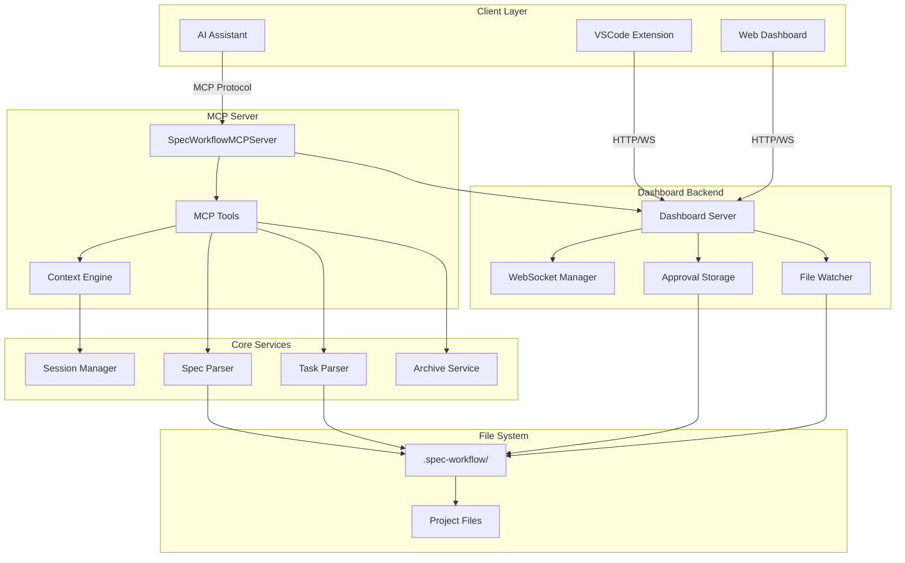
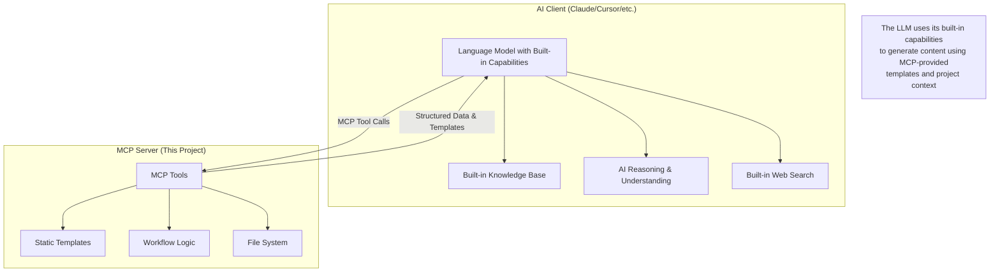
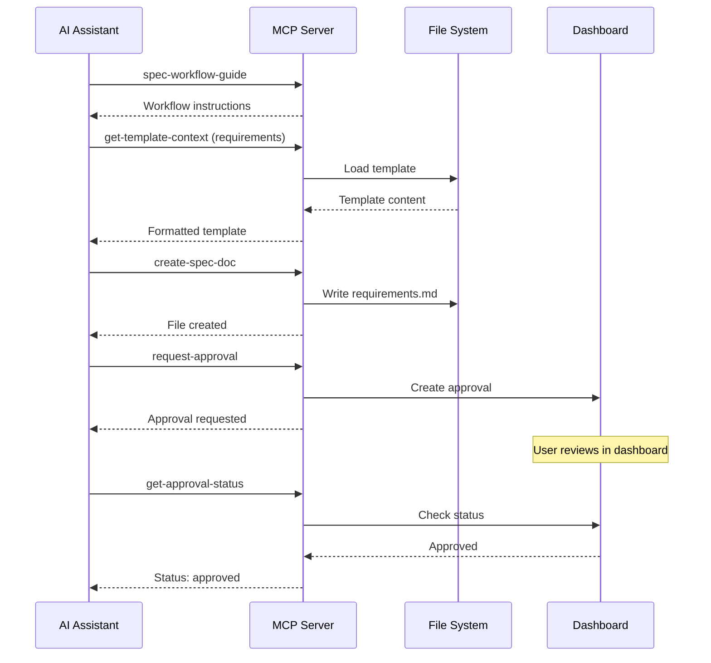
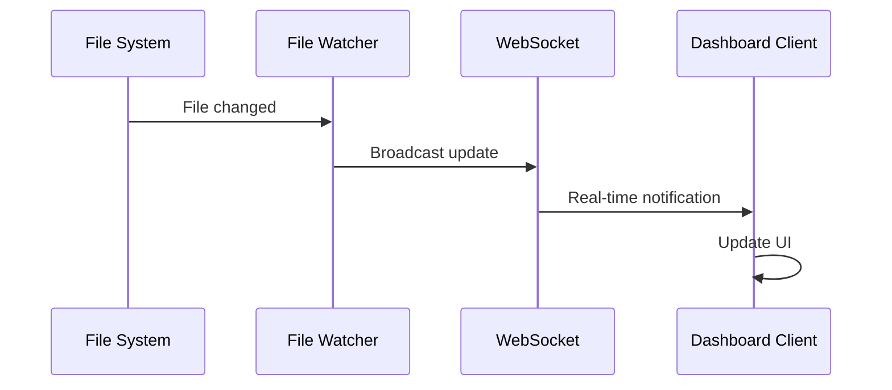

# Architecture Overview

> **TL;DR**: MCP server with structured workflow tools, real-time dashboard, and intelligent context management.

## 🏗️ System Architecture

### High-Level Components



## 🤖 AI Architecture & Integration Model

### Pure MCP Server Design

This is a **pure Model Context Protocol (MCP) server** that leverages the connected LLM's built-in capabilities through structured tool interactions:



**Key Architectural Principles:**

1. **Leverages LLM Built-in Capabilities**: Uses the connected AI's existing knowledge, reasoning, and search capabilities
2. **No Separate External Calls**: MCP server makes no independent API calls (except NPM version check)
3. **LLM-Powered Content Generation**: The connected LLM generates all content using its built-in understanding
4. **Structured Workflow**: Provides templates and enforces workflow, letting LLM fill in intelligent content
5. **Human Approval Gateway**: All LLM-generated content requires human review before proceeding

### Detailed Capability Analysis & Expansion Opportunities

| Capability | Current Implementation | LLM Built-in Features | Potential MCP Enhancements | Competitive Analysis |
|------------|----------------------|---------------------|---------------------------|---------------------|
| **Web Scraping & Research** | ❌ No independent capability | ✅ LLM has built-in web search | 🔮 Could add: Structured web scraping tools, API integrations, research caching | Other agents: Custom scrapers, API wrappers |
| **AI-Powered Analysis** | ❌ No independent AI calls | ✅ LLM provides all analysis | 🔮 Could add: Specialized analysis tools, code quality metrics | Other agents: Multiple AI model integration |
| **Context Window Management** | ❌ No LLM context management | ✅ LLM manages conversation context | 🔮 Could add: Context optimization, memory management | Other agents: Advanced context strategies |
| **External Integrations** | ❌ Only NPM version check | ✅ LLM can call external APIs | 🔮 Could add: GitHub integration, CI/CD hooks, database connections | Other agents: Extensive API ecosystems |
| **Auto Review Process** | ❌ Human approval only | ✅ LLM can analyze and review | 🔮 Could add: Automated quality gates, AI-powered approvals | Other agents: Multi-stage AI review |
| **Best Practice Standards** | ❌ Static templates only | ✅ LLM has current best practices | 🔮 Could add: Dynamic template updates, standards APIs | Other agents: Live standards databases |
| **Planning & Orchestration** | ❌ Fixed workflow sequence | ✅ LLM can plan and reason | 🔮 Could add: Dynamic workflows, adaptive planning | Other agents: Complex orchestration engines |

### Competitive Feature Analysis

**vs Traditional Development Tools:**
```typescript
interface CompetitiveAnalysis {
  specWorkflowMCP: {
    strengths: [
      "Human oversight integration",
      "Structured workflow enforcement", 
      "Real-time dashboard monitoring",
      "LLM-powered intelligent content"
    ];
    limitations: [
      "No independent web scraping",
      "No automated AI review",
      "Fixed workflow templates",
      "Single project scope"
    ];
  };
  
  competitorAgents: {
    strengths: [
      "Multi-model AI integration",
      "Advanced web scraping capabilities", 
      "Automated quality assurance",
      "Dynamic workflow adaptation"
    ];
    limitations: [
      "Less human oversight",
      "Complex setup requirements",
      "Higher resource usage",
      "Potential runaway behavior"
    ];
  };
}
```

**Expansion Roadmap Insights:**
```typescript
interface ExpansionOpportunities {
  phase1: {
    webIntegration: "Add GitHub API, Jira integration, Confluence sync";
    smartTemplates: "Dynamic templates based on project type detection";
    qualityGates: "Automated code quality analysis using LLM";
  };
  
  phase2: {
    aiWorkflows: "LLM-powered adaptive workflow generation";
    codeAnalysis: "Deep codebase analysis and refactoring suggestions";
    teamCollaboration: "Multi-developer coordination and conflict resolution";
  };
  
  phase3: {
    enterpriseFeatures: "SSO, audit trails, compliance reporting";
    aiOrchestration: "Multi-agent coordination and task delegation";
    predictiveAnalysis: "Project risk analysis and timeline prediction";
  };
}
```

### How the LLM's Built-in Capabilities Are Currently Utilized

| LLM Capability | How MCP Leverages It | Example | Expansion Potential |
|---------------|---------------------|---------|-------------------|
| **Built-in Knowledge** | LLM applies software engineering best practices to templates | Uses SOLID principles when filling design templates | 🔮 Dynamic best practice updates |
| **Reasoning & Understanding** | LLM analyzes project context and generates appropriate content | Creates relevant requirements based on project analysis | 🔮 Advanced project risk assessment |
| **Built-in Web Search** | LLM can research current technologies and practices | Looks up latest React patterns when generating components | 🔮 Structured research caching |
| **Code Understanding** | LLM analyzes existing codebase when provided context | Suggests appropriate API designs based on existing patterns | 🔮 Automated refactoring suggestions |
| **Technical Writing** | LLM generates well-structured technical documentation | Creates professional requirements and design documents | 🔮 Multi-format documentation generation |

### Context Flow Architecture

```typescript
// How context flows from project files to AI client
interface ContextFlow {
  1: "AI Client requests context via MCP tool call";
  2: "MCP Server loads files from .spec-workflow/ directory";
  3: "MCP Server structures data using templates and parsing";
  4: "MCP Server returns formatted context to AI Client";
  5: "AI Client uses context in its reasoning and generation";
}
```

**Important**: The MCP server does NOT extend the AI client's context window - it provides structured data that the AI client incorporates into its own context management.

## 🔧 Core Components

### MCP Server (`src/server.ts`)

The main server class that orchestrates all functionality:

```typescript
export class SpecWorkflowMCPServer {
  private server: Server;
  private dashboardServer?: DashboardServer;
  private sessionManager?: SessionManager;
}
```

**Key Responsibilities:**
- **Tool Registration**: Manages 13 MCP tools
- **Session Tracking**: Monitors dashboard connections
- **Graceful Shutdown**: Handles client disconnections
- **Context Coordination**: Provides shared context to tools

### Tool System (`src/tools/`)

Implements the Model Context Protocol with structured tools:

```typescript
// Tool categories
const tools = [
  // Workflow guides
  'spec-workflow-guide', 'steering-guide',
  
  // Document creation  
  'create-spec-doc', 'create-steering-doc',
  
  // Context loading
  'get-spec-context', 'get-steering-context', 'get-template-context',
  
  // Status management
  'spec-list', 'spec-status', 'manage-tasks', 'refresh-tasks',
  
  // Approval workflow
  'request-approval', 'get-approval-status', 'delete-approval'
];
```

**Tool Architecture Pattern:**
```typescript
export const toolNameTool: Tool = {
  name: 'tool-name',
  description: 'Clear description with usage instructions',
  inputSchema: { /* JSON Schema validation */ }
};

export async function toolNameHandler(
  args: ValidatedArgs, 
  context: ToolContext
): Promise<ToolResponse> {
  // Implementation
}
```

### Context Engine

Intelligent context management for efficient token usage:

```typescript
interface ToolContext {
  projectPath: string;
  dashboardUrl?: string;
  sessionManager?: SessionManager;
}
```

**Context Strategies:**
- **Pre-loading**: Templates cached at startup
- **Lazy Loading**: Specs loaded on-demand  
- **Cache Invalidation**: Content refreshed when files change
- **Smart Chunking**: Large documents split appropriately

## 🗂️ Data Flow

### 1. Workflow Creation Flow



### 2. Real-time Dashboard Updates



## 📁 File System Organization

### Project Structure
```
project-root/
├── .spec-workflow/              # All workflow data
│   ├── specs/                   # Specifications
│   │   └── feature-name/        # Individual spec
│   │       ├── requirements.md  # Phase 1
│   │       ├── design.md        # Phase 2
│   │       └── tasks.md         # Phase 3
│   ├── steering/                # Project guidance
│   │   ├── product.md           # Product vision
│   │   ├── tech.md              # Technical standards
│   │   └── structure.md         # Code organization
│   ├── approvals/               # Approval workflow data
│   │   └── spec-name/           # Per-spec approvals
│   └── session.json             # Active dashboard session
└── [your project files]        # Existing project
```

### Directory Responsibilities

| Directory | Purpose | Auto-created |
|-----------|---------|--------------|
| `specs/` | Specification documents | ✅ |  
| `steering/` | Project guidance | ✅ |
| `approvals/` | Approval workflow | On-demand |
| `archive/` | Completed specs | On-demand |

## 🌐 Dashboard Architecture

### Backend (`src/dashboard/server.ts`)

Fastify-based server with WebSocket support:

```typescript
export class DashboardServer {
  private app: FastifyInstance;
  private watcher: SpecWatcher;
  private approvalStorage: ApprovalStorage;
  private clients: Set<WebSocket>;
}
```

**Features:**
- **Static File Serving**: Frontend assets
- **WebSocket**: Real-time updates
- **REST API**: CRUD operations
- **File Watching**: Auto-refresh on changes

### Frontend (`src/dashboard_frontend/`)

React application with modern tooling:

```
src/
├── modules/
│   ├── pages/           # Main application pages
│   ├── components/      # Reusable UI components  
│   ├── api/            # API communication
│   └── ws/             # WebSocket integration
├── main.tsx            # Application entry point
└── App.tsx            # Root component
```

**Technology Stack:**
- **React 18**: Component framework
- **TypeScript**: Type safety  
- **Vite**: Build tool and dev server
- **Tailwind CSS**: Utility-first styling
- **WebSocket**: Real-time communication

## 🔄 State Management

### Session State
- **Server**: Tracks active dashboard URLs
- **Client**: Maintains connection to specific dashboard instance
- **Persistence**: `.spec-workflow/session.json`

### Approval State  
- **Storage**: JSON files in `approvals/` directory
- **Lifecycle**: pending → approved/rejected → archived
- **Sync**: Real-time updates via WebSocket

### Spec State
- **Parsing**: On-demand from markdown files
- **Caching**: In-memory with file change invalidation  
- **Distribution**: Broadcast to connected clients

## 🚦 Error Handling

### Tool Error Response Pattern
```typescript
interface ToolResponse {
  success: boolean;
  message: string;
  data?: any;
  nextSteps?: string[];
  projectContext?: {
    projectPath: string;
    workflowRoot: string;
    dashboardUrl?: string;
  };
}
```

### Error Categories
1. **Validation Errors**: Invalid parameters
2. **File System Errors**: Permission, not found
3. **Network Errors**: Dashboard connection issues
4. **Workflow Errors**: Out-of-sequence operations

## ⚡ Performance & Scalability

### Resource Usage & Limits

**Memory Consumption**:
```typescript
interface ResourceLimits {
  // Per-project memory usage
  templates: "~50KB (cached at startup)";
  specContext: "10-100KB per spec";
  approvalData: "1-5KB per approval";
  sessionData: "<1KB per project";
  
  // Recommended project limits
  maxSpecs: "50-100 specs per project";
  maxDocumentSize: "200KB per document";
  maxProjectSize: "5-10MB total .spec-workflow/";
  
  // Performance thresholds
  contextLoadTime: "<200ms for typical spec";
  dashboardResponse: "<50ms for API calls";
  fileWatcherDelay: "500ms debounce";
}
```

**File System Performance**:
- **Template Loading**: <10ms (cached permanently)
- **Spec Context Loading**: 50-200ms cold, <5ms cached
- **Dashboard API Response**: <50ms typical
- **File Watcher Reaction**: 500ms debounced

### Scalability Constraints

**Single Project Limits**:
```bash
# Recommended maximums per project
Specifications: 50-100
Documents per spec: 3 (requirements, design, tasks)  
Document size: 200KB each
Total project size: 5-10MB
Concurrent dashboard users: 1 per project
File watch depth: .spec-workflow/ only
```

**Multi-Project Scaling**:
- Each project runs independent MCP server instance
- No shared state between projects
- Linear scaling: N projects = N server instances
- Memory usage scales linearly with project count

### Performance Optimization Strategies

**File System Optimization**:
```typescript
// Implemented optimizations
1. "Template pre-loading and permanent caching";
2. "LRU cache for spec contexts (50 entries max)";
3. "Debounced file watching (500ms)";
4. "Lazy loading of approval data";
5. "Efficient path resolution with PathUtils";
```

**Memory Management**:
```typescript
// Memory optimization patterns
interface MemoryOptimization {
  templateCache: "Permanent - small static data";
  specCache: "LRU with 50MB limit";
  approvalStorage: "On-demand loading";
  sessionTracking: "Minimal metadata only";
  
  cleanup: {
    specCacheEviction: "LRU when limit reached";
    approvalCleanup: "Manual deletion after approval";
    sessionExpiry: "On server restart";
  };
}
```

## 🔒 Security Considerations

### File System Access
- **Restricted Scope**: Only `.spec-workflow/` directory  
- **Path Validation**: Prevents directory traversal
- **Safe Operations**: No arbitrary command execution

### Network Security
- **Local Only**: Dashboard binds to localhost
- **No External Calls**: Except version check (optional)
- **Input Validation**: All parameters sanitized

### Data Privacy
- **Local Storage**: All data stays on user's machine
- **No Telemetry**: No usage data transmitted
- **Session Isolation**: Each project has separate session

### Enterprise Security Considerations

**Network Security**:
```typescript
interface NetworkSecurity {
  inboundConnections: "Only localhost dashboard (port 3456)";
  outboundConnections: "Only NPM registry version check";
  dataTransmission: "No external data transmission";
  tlsCertificates: "Not required - localhost only";
  firewall: "Allow localhost:3456 for dashboard access";
}
```

**Data Governance**:
```typescript
interface DataGovernance {
  dataLocation: "All data in project .spec-workflow/ directory";
  dataRetention: "Manual - user controls all data lifecycle";
  dataDeletion: "rm -rf .spec-workflow/ removes all MCP data";
  auditTrail: "File system timestamps, no application logging";
  compliance: "No data leaves local machine (except version check)";
}
```

**Access Control**:
- **File System**: Uses OS file permissions
- **Dashboard**: No authentication - localhost access only  
- **VS Code**: Integrated with VS Code user session
- **Multi-User**: Not designed for multi-user environments

**Enterprise Deployment Considerations**:
```bash
# Corporate firewall rules
Allow outbound: registry.npmjs.org (443) # Version checking only
Allow inbound: None required
Allow localhost: 3456 (dashboard), dynamic ports (MCP)

# Security scanning
Static analysis: TypeScript codebase, no binary dependencies
Vulnerability scanning: NPM audit, no external services
Data classification: All data user-controlled, local storage only
```

---

**Next**: [MCP Tools API Reference →](api-reference.md)