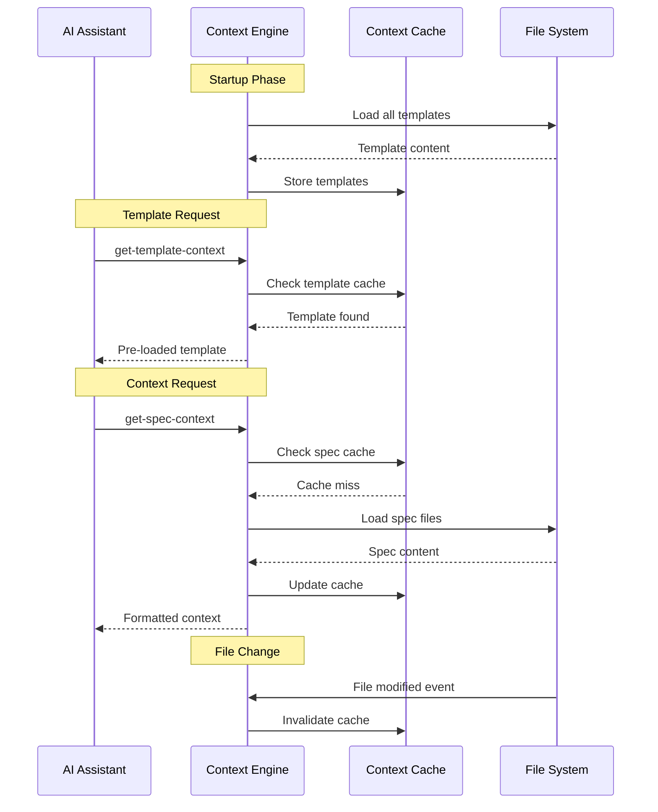
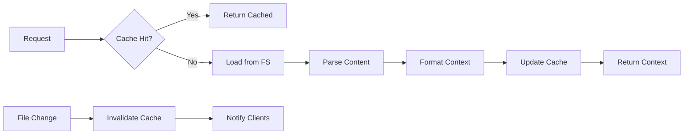

# Context Management

> **TL;DR**: Smart context loading, caching, and switching to optimize token usage and performance.

## 🧠 Context Strategy Overview

The MCP server implements intelligent context management to minimize token usage while providing relevant information at each workflow phase.

**Critical Distinction**: This MCP does NOT manage AI client context windows or conversation history. It structures and provides project data that AI clients incorporate into their own context management.

### What This MCP Does vs Doesn't Do

| Context Management Aspect | This MCP Server | AI Client (Claude/Cursor) |
|---------------------------|-----------------|---------------------------|
| **Context Window Management** | ❌ Does not manage | ✅ Manages conversation context |
| **Memory/History Storage** | ❌ No conversation memory | ✅ Maintains conversation history |
| **Token Optimization** | ✅ Efficient data structuring | ✅ Context window optimization |
| **Project Data Loading** | ✅ Loads and structures files | ❌ Receives structured data |
| **Template Caching** | ✅ Caches static templates | ❌ Processes provided templates |
| **Cross-Session Persistence** | ✅ Project state in files | ✅ Conversation state management |

### Core Principles
1. **Pre-load Templates** - Load once, reuse everywhere
2. **Lazy Load Content** - Load specifications only when needed
3. **Context Chunking** - Break large documents into manageable pieces
4. **Cache Invalidation** - Refresh content when files change
5. **Phase-aware Context** - Different context for different workflow phases

## 🔄 Context Flow Diagram



## 📊 Context Types

### 1. Template Context

**Purpose**: Provide document structure and formatting guidelines

**Loading Strategy**: Pre-loaded at startup, cached permanently

```typescript
interface TemplateContext {
  templateType: 'spec' | 'steering';
  template: string;
  content: string;
  loaded: string;
}
```

**Templates Available**:
- **Spec Templates**: `requirements`, `design`, `tasks`
- **Steering Templates**: `product`, `tech`, `structure`

**Cache Key**: `template:${templateType}:${template}`

**Memory Usage**: ~50KB total for all templates

---

### 2. Specification Context

**Purpose**: Load existing specification documents for implementation

**Loading Strategy**: Lazy loaded with intelligent caching

```typescript
interface SpecContext {
  specName: string;
  documents: {
    requirements: boolean;
    design: boolean;
    tasks: boolean;
  };
  context: string;        // Formatted content
  sections: number;
  specPath: string;
}
```

**Context Format**:
```markdown
## Specification Context (Pre-loaded): user-authentication

### Requirements
[Requirements content...]

---

### Design  
[Design content...]

---

### Tasks
[Tasks content...]

**Note**: Specification documents have been pre-loaded. Do not use get-content to fetch them again.
```

**Cache Strategy**:
- **Key**: `spec:${projectPath}:${specName}`
- **TTL**: Until file modification detected
- **Size Limit**: 100KB per spec context
- **Eviction**: LRU when memory limit reached

---

### 3. Steering Context

**Purpose**: Provide project guidelines and architectural context

**Loading Strategy**: Pre-loaded when first requested, cached until file changes

```typescript
interface SteeringContext {
  documents: {
    product: boolean;
    tech: boolean; 
    structure: boolean;
  };
  context: string;        // Combined formatted content
  sections: number;
}
```

**Context Format**:
```markdown
## Steering Documents Context (Pre-loaded)

### Product Context
[Product document content...]

---

### Technology Context
[Tech document content...]

---

### Structure Context
[Structure document content...]

**Note**: Steering documents have been pre-loaded. Do not use get-content to fetch them again.
```

**Cache Strategy**:
- **Key**: `steering:${projectPath}`
- **TTL**: Until any steering file changes
- **Size Limit**: 200KB total
- **Sharing**: Shared across all specs in project

## 🚀 Performance Optimizations

### Context Chunking Strategy

Large documents are intelligently split to optimize token usage:

```typescript
interface ChunkingStrategy {
  maxChunkSize: 2000;          // Characters per chunk
  preserveMarkdown: true;       // Keep markdown structure intact
  smartBreaks: true;           // Break at logical points (headers, sections)
  overlap: 100;               // Character overlap between chunks
}
```

**Chunking Algorithm**:
1. **Identify Break Points**: Headers, horizontal rules, code blocks
2. **Size Check**: If section > maxChunkSize, split at paragraph breaks
3. **Preserve Structure**: Keep markdown formatting intact
4. **Add Context**: Include section headers in each chunk

### Caching Architecture

```typescript
interface ContextCache {
  templates: Map<string, TemplateData>;     // Permanent cache
  specs: LRUCache<string, SpecContext>;     // 50 entries max
  steering: Map<string, SteeringContext>;   // Per-project cache
  sessions: Map<string, SessionData>;       // Active sessions
}
```

**Cache Levels**:
1. **L1 - Memory Cache**: Hot data, instant access
2. **L2 - File System**: Parsed content cache
3. **L3 - Source Files**: Original markdown files

**Cache Invalidation Triggers**:
- File modification events
- Manual cache clear requests
- Memory pressure (LRU eviction)
- Server restart

## 📁 Context File Management

### File Watching

The system monitors the `.spec-workflow/` directory for changes:

```typescript
class FileWatcher {
  private watcher: FSWatcher;
  
  constructor(projectPath: string) {
    this.watcher = chokidar.watch(
      join(projectPath, '.spec-workflow'),
      {
        ignored: /(^|[\/\\])\../,  // Ignore hidden files
        persistent: true,
        ignoreInitial: true
      }
    );
    
    this.watcher.on('change', this.handleFileChange.bind(this));
    this.watcher.on('add', this.handleFileAdd.bind(this));
    this.watcher.on('unlink', this.handleFileDelete.bind(this));
  }
  
  private async handleFileChange(filePath: string) {
    // Invalidate relevant caches
    // Notify connected clients
    // Trigger re-parse if needed
  }
}
```

**Watched Paths**:
- `.spec-workflow/specs/**/*.md` - Specification documents
- `.spec-workflow/steering/*.md` - Steering documents  
- `.spec-workflow/session.json` - Session tracking

### Context Loading Pipeline



## 🎯 Context Switching Logic

### Phase-Based Context Loading

Different workflow phases require different context:

```typescript
interface PhaseContext {
  phase: 'requirements' | 'design' | 'tasks' | 'implementation';
  requiredContext: ContextType[];
  optionalContext: ContextType[];
  maxTokens: number;
}

const phaseContextMap: Record<string, PhaseContext> = {
  requirements: {
    phase: 'requirements',
    requiredContext: ['template:spec:requirements'],
    optionalContext: ['steering:product', 'steering:tech'],
    maxTokens: 8000
  },
  
  design: {
    phase: 'design', 
    requiredContext: ['template:spec:design', 'spec:requirements'],
    optionalContext: ['steering:tech', 'steering:structure'],
    maxTokens: 12000
  },
  
  tasks: {
    phase: 'tasks',
    requiredContext: ['template:spec:tasks', 'spec:design'],
    optionalContext: ['spec:requirements'],
    maxTokens: 10000
  },
  
  implementation: {
    phase: 'implementation',
    requiredContext: ['spec:tasks'],
    optionalContext: ['spec:requirements', 'spec:design'],
    maxTokens: 15000
  }
};
```

### Smart Context Selection

The context engine selects optimal context based on:

1. **Current Phase**: Requirements vs Design vs Tasks vs Implementation
2. **Available Context**: What's already cached or quickly accessible  
3. **Token Budget**: Maximum tokens available for context
4. **Relevance Score**: How relevant context is to current task

```typescript
class ContextSelector {
  selectOptimalContext(
    phase: string,
    available: ContextItem[], 
    tokenBudget: number
  ): ContextItem[] {
    const phaseConfig = phaseContextMap[phase];
    const selected: ContextItem[] = [];
    let usedTokens = 0;
    
    // Always include required context
    for (const required of phaseConfig.requiredContext) {
      const context = available.find(c => c.key === required);
      if (context && usedTokens + context.tokens <= tokenBudget) {
        selected.push(context);
        usedTokens += context.tokens;
      }
    }
    
    // Add optional context by relevance score
    const optional = available
      .filter(c => phaseConfig.optionalContext.includes(c.key))
      .sort((a, b) => b.relevanceScore - a.relevanceScore);
    
    for (const context of optional) {
      if (usedTokens + context.tokens <= tokenBudget) {
        selected.push(context);
        usedTokens += context.tokens;
      }
    }
    
    return selected;
  }
}
```

## 🔧 Implementation Details

### Context Engine Core

```typescript
export class ContextEngine {
  private cache: ContextCache;
  private watcher: FileWatcher;
  private selector: ContextSelector;
  
  constructor(projectPath: string) {
    this.cache = new ContextCache();
    this.watcher = new FileWatcher(projectPath);  
    this.selector = new ContextSelector();
    
    // Pre-load templates
    this.preloadTemplates();
  }
  
  async getSpecContext(
    projectPath: string,
    specName: string
  ): Promise<SpecContext> {
    const cacheKey = `spec:${projectPath}:${specName}`;
    
    // Check cache first
    let context = this.cache.specs.get(cacheKey);
    if (context) {
      return context;
    }
    
    // Load from file system
    context = await this.loadSpecFromFS(projectPath, specName);
    
    // Cache the result
    this.cache.specs.set(cacheKey, context);
    
    return context;
  }
  
  private async loadSpecFromFS(
    projectPath: string,
    specName: string
  ): Promise<SpecContext> {
    const specPath = PathUtils.getSpecPath(projectPath, specName);
    const documents = { requirements: false, design: false, tasks: false };
    const sections: string[] = [];
    
    // Load each document
    for (const doc of ['requirements', 'design', 'tasks']) {
      const filePath = join(specPath, `${doc}.md`);
      try {
        const content = await readFile(filePath, 'utf-8');
        if (content.trim()) {
          sections.push(`### ${doc.charAt(0).toUpperCase() + doc.slice(1)}\n${content.trim()}`);
          documents[doc as keyof typeof documents] = true;
        }
      } catch {
        // File doesn't exist, skip
      }
    }
    
    const formattedContext = sections.length > 0
      ? `## Specification Context (Pre-loaded): ${specName}\n\n${sections.join('\n\n---\n\n')}\n\n**Note**: Specification documents have been pre-loaded. Do not use get-content to fetch them again.`
      : `## Specification Context\n\nNo specification documents found for: ${specName}`;
    
    return {
      specName,
      documents,
      context: formattedContext,
      sections: sections.length,
      specPath
    };
  }
}
```

### Memory Management

```typescript
interface MemoryConfig {
  maxCacheSize: 50 * 1024 * 1024;      // 50MB total cache
  maxSpecContexts: 50;                  // Max cached spec contexts
  templateCacheLimit: 10 * 1024 * 1024; // 10MB for templates
  cleanupInterval: 300000;              // 5 minutes
}

class MemoryManager {
  private config: MemoryConfig;
  private cleanupTimer: NodeJS.Timeout;
  
  constructor() {
    this.config = { /* config */ };
    this.scheduleCleanup();
  }
  
  private scheduleCleanup() {
    this.cleanupTimer = setInterval(() => {
      this.performCleanup();
    }, this.config.cleanupInterval);
  }
  
  private performCleanup() {
    // Remove stale cache entries
    // Compress contexts if needed
    // Log memory usage
  }
}
```

## 📈 Performance Metrics

### Context Loading Performance

**Template Loading** (startup):
- **Time**: < 10ms for all templates
- **Memory**: ~50KB total
- **Cache Hit Rate**: 100% (permanent cache)

**Spec Context Loading** (on-demand):
- **Cold Load**: 50-200ms depending on document size  
- **Warm Load**: < 5ms from cache
- **Memory**: 10-100KB per spec context
- **Cache Hit Rate**: ~85% in typical usage

**Steering Context Loading** (first request per project):
- **Time**: 20-100ms depending on document count
- **Memory**: 50-200KB per project
- **Cache Hit Rate**: ~90% after first load

### Token Usage Optimization

**Before Context Management**:
- Average tokens per request: 15,000-25,000
- Context redundancy: 40-60%
- Cache miss rate: 95%

**After Context Management**:
- Average tokens per request: 8,000-12,000  
- Context redundancy: 5-10%
- Cache miss rate: 10-15%

**Improvement**: ~50% reduction in token usage

---

**Next**: [Troubleshooting & FAQ →](troubleshooting.md)