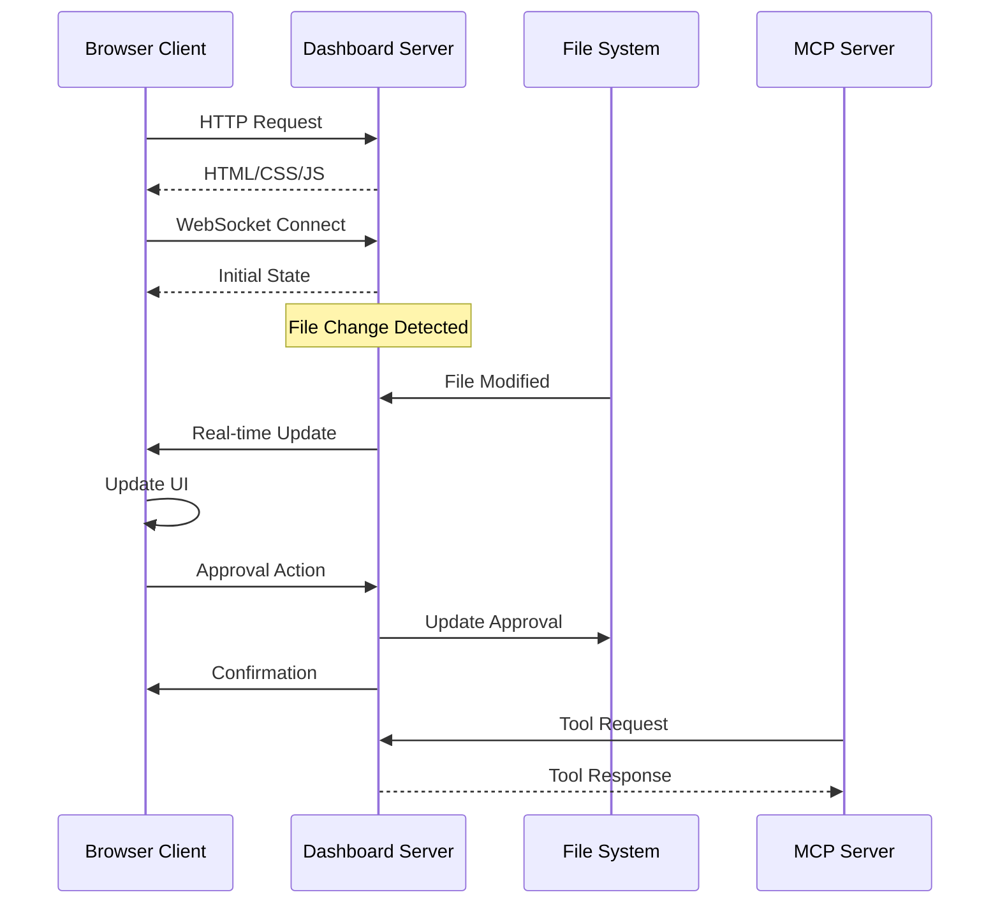

# Dashboard System

> **TL;DR**: Real-time web dashboard for monitoring specs, managing approvals, and tracking progress.

## 🌐 Dashboard Overview

The dashboard provides a web interface for:
- **Specification Management** - View, create, and organize specs
- **Approval Workflow** - Review and approve documents  
- **Task Tracking** - Monitor implementation progress
- **Real-time Updates** - Live sync via WebSocket
- **Document Viewing** - Browse markdown documents with syntax highlighting

## 🏗️ Architecture

### Frontend Stack
- **React 18** - Component framework with hooks
- **TypeScript** - Type-safe development
- **Tailwind CSS** - Utility-first styling
- **Vite** - Fast build tool and dev server
- **React Router** - Client-side routing

### Backend Stack
- **Fastify** - High-performance web server
- **WebSocket** - Real-time communication
- **Chokidar** - File system watching
- **Markdown-it** - Markdown parsing and rendering

### Communication Flow



## 🚀 Starting the Dashboard

### Standalone Mode
```bash
# Dashboard only (no MCP server)
npx -y @pimzino/spec-workflow-mcp@latest --dashboard

# With custom port
npx -y @pimzino/spec-workflow-mcp@latest --dashboard --port 8080

# From specific project directory
cd /path/to/project
npx -y @pimzino/spec-workflow-mcp@latest --dashboard
```

### Auto-Start with MCP Server
```json
{
  "mcpServers": {
    "spec-workflow": {
      "command": "npx",
      "args": ["-y", "@pimzino/spec-workflow-mcp@latest", "/project/path", "--AutoStartDashboard"]
    }
  }
}
```

### Development Mode
```bash
# Start dashboard dev server (hot reload)
npm run dev:dashboard

# Available at http://localhost:5173
# Connects to backend at http://localhost:3456
```

## 📱 User Interface

### Main Navigation

```
┌─────────────────────────────────────┐
│ Spec Workflow Dashboard             │
├─────────────────────────────────────┤
│ 📋 Specs      │ Main Content Area   │
│ 📝 Steering   │                     │
│ ✅ Approvals  │                     │  
│ 📊 Tasks      │                     │
│ 📈 Statistics │                     │
└─────────────────────────────────────┘
```

### Page Components

#### Specs Page (`SpecsPage.tsx`)
```typescript
interface SpecsPageProps {
  specs: SpecData[];
  onSpecSelect: (spec: SpecData) => void;
}

// Features:
// - List all specifications
// - Show status (not-started, in-progress, ready, implementing, completed)
// - Progress bars for task completion
// - Quick actions (view, archive, delete)
```

#### Approval Page (`ApprovalsPage.tsx`)
```typescript
interface ApprovalsPageProps {
  approvals: ApprovalData[];
  onApprovalAction: (id: string, action: 'approve' | 'reject') => void;
}

// Features:
// - List pending approvals
// - Document preview with syntax highlighting
// - Approve/reject with comments
// - Real-time status updates
```

#### Spec Viewer (`SpecViewerPage.tsx`)
```typescript
interface SpecViewerProps {
  specName: string;
  documents: SpecDocuments;
}

// Features:
// - Tabbed interface (Requirements, Design, Tasks)
// - Markdown rendering with code highlighting
// - Task status indicators
// - Document metadata (created, modified, status)
```

#### Tasks Page (`TasksPage.tsx`)
```typescript
interface TasksPageProps {
  tasks: TaskData[];
  onTaskUpdate: (taskId: string, status: TaskStatus) => void;
}

// Features:
// - Task list with status indicators
// - Progress tracking per specification
// - Filter by status (pending, in-progress, completed)
// - Bulk task operations
```

## 🔄 Real-time Features

### WebSocket Integration

**Connection Setup**:
```typescript
// src/dashboard_frontend/src/modules/ws/WebSocketProvider.tsx
const WebSocketProvider = ({ children }: { children: React.ReactNode }) => {
  const [socket, setSocket] = useState<WebSocket | null>(null);
  const [message, setMessage] = useState<any>(null);
  
  useEffect(() => {
    const ws = new WebSocket('ws://localhost:3456/ws');
    
    ws.onmessage = (event) => {
      const data = JSON.parse(event.data);
      setMessage(data);
    };
    
    ws.onopen = () => {
      console.log('WebSocket connected');
    };
    
    ws.onerror = (error) => {
      console.error('WebSocket error:', error);
    };
    
    setSocket(ws);
    
    return () => {
      ws.close();
    };
  }, []);
  
  return (
    <WebSocketContext.Provider value={{ socket, message }}>
      {children}
    </WebSocketContext.Provider>
  );
};
```

**Message Types**:
```typescript
interface WebSocketMessage {
  type: 'initial' | 'specs-updated' | 'approval-updated' | 'task-updated';
  data: any;
  timestamp: string;
}

// Example messages
const messages = {
  initial: {
    type: 'initial',
    data: { specs: [], approvals: [] }
  },
  
  specsUpdated: {
    type: 'specs-updated', 
    data: { specs: [/* updated specs */] }
  },
  
  approvalUpdated: {
    type: 'approval-updated',
    data: { approvalId: '...', status: 'approved' }
  }
};
```

### File Watching

**Backend File Watcher**:
```typescript
// src/dashboard/watcher.ts
export class SpecWatcher {
  private watcher: FSWatcher;
  
  constructor(projectPath: string, parser: SpecParser) {
    this.watcher = chokidar.watch(
      join(projectPath, '.spec-workflow'),
      {
        ignored: /(^|[\/\\])\../, // Ignore hidden files
        persistent: true,
        ignoreInitial: true
      }
    );
    
    this.watcher.on('change', async (filePath) => {
      // Re-parse affected specs
      const specs = await parser.getAllSpecs();
      // Broadcast to all connected clients
      this.broadcastUpdate('specs-updated', { specs });
    });
  }
  
  private broadcastUpdate(type: string, data: any) {
    const message = JSON.stringify({ type, data, timestamp: new Date().toISOString() });
    this.clients.forEach(client => {
      if (client.readyState === WebSocket.OPEN) {
        client.send(message);
      }
    });
  }
}
```

## 🎨 Styling & Theming

### Theme System

**Theme Provider**:
```typescript
// src/dashboard_frontend/src/modules/theme/ThemeProvider.tsx
const ThemeProvider = ({ children }: { children: React.ReactNode }) => {
  const [theme, setTheme] = useState<'light' | 'dark'>('light');
  
  useEffect(() => {
    // Auto-detect system theme
    const mediaQuery = window.matchMedia('(prefers-color-scheme: dark)');
    setTheme(mediaQuery.matches ? 'dark' : 'light');
    
    mediaQuery.addEventListener('change', (e) => {
      setTheme(e.matches ? 'dark' : 'light');
    });
  }, []);
  
  return (
    <div className={theme === 'dark' ? 'dark' : ''}>
      {children}
    </div>
  );
};
```

**Color Palette**:
```css
/* src/dashboard_frontend/src/modules/theme/theme.css */
:root {
  /* Light theme */
  --color-primary: #3b82f6;
  --color-secondary: #64748b;  
  --color-success: #10b981;
  --color-warning: #f59e0b;
  --color-error: #ef4444;
  --color-background: #ffffff;
  --color-surface: #f8fafc;
  --color-text: #1f2937;
}

.dark {
  /* Dark theme */
  --color-primary: #60a5fa;
  --color-secondary: #94a3b8;
  --color-success: #34d399; 
  --color-warning: #fbbf24;
  --color-error: #f87171;
  --color-background: #1f2937;
  --color-surface: #374151;
  --color-text: #f9fafb;
}
```

### Component Styling

**Tailwind Configuration**:
```javascript
// tailwind.config.js
module.exports = {
  content: ['./src/**/*.{js,ts,jsx,tsx}'],
  darkMode: 'class',
  theme: {
    extend: {
      colors: {
        primary: 'var(--color-primary)',
        secondary: 'var(--color-secondary)',
        success: 'var(--color-success)',
        warning: 'var(--color-warning)',
        error: 'var(--color-error)',
        background: 'var(--color-background)',
        surface: 'var(--color-surface)',
        text: 'var(--color-text)'
      }
    }
  }
};
```

## 🔧 Backend API

### REST Endpoints

```typescript
// Main API routes
const routes = {
  // Specs
  'GET /api/specs': 'List all specifications',
  'GET /api/specs/:name': 'Get specific spec with details',
  'PUT /api/specs/:name': 'Update spec metadata',
  'DELETE /api/specs/:name': 'Delete specification',
  
  // Approvals
  'GET /api/approvals': 'List pending approvals',
  'GET /api/approvals/:id': 'Get approval details',
  'POST /api/approvals/:id/approve': 'Approve document',
  'POST /api/approvals/:id/reject': 'Reject with comments',
  'DELETE /api/approvals/:id': 'Delete approval',
  
  // Tasks
  'GET /api/tasks/:specName': 'Get tasks for specification',
  'PUT /api/tasks/:specName/:taskId': 'Update task status',
  
  // System
  'GET /api/health': 'Health check endpoint',
  'GET /api/version': 'Get server version info'
};
```

**Example API Implementation**:
```typescript
// src/dashboard/server.ts
export class DashboardServer {
  private async setupRoutes() {
    // Get all specifications
    this.app.get('/api/specs', async (request, reply) => {
      try {
        const specs = await this.parser.getAllSpecs();
        reply.send({ success: true, data: specs });
      } catch (error) {
        reply.status(500).send({ success: false, error: error.message });
      }
    });
    
    // Approve document
    this.app.post('/api/approvals/:id/approve', async (request, reply) => {
      try {
        const { id } = request.params as { id: string };
        await this.approvalStorage.approveDocument(id);
        
        // Broadcast update
        this.broadcastToClients('approval-updated', { approvalId: id, status: 'approved' });
        
        reply.send({ success: true });
      } catch (error) {
        reply.status(500).send({ success: false, error: error.message });
      }
    });
  }
}
```

## 📊 Performance Optimizations

### Frontend Optimizations

**React Optimizations**:
```typescript
// Memoized components for expensive renders
const SpecsList = React.memo(({ specs }: { specs: SpecData[] }) => {
  return (
    <div>
      {specs.map(spec => (
        <SpecCard key={spec.name} spec={spec} />
      ))}
    </div>
  );
});

// Virtualized lists for large datasets
import { FixedSizeList as List } from 'react-window';

const VirtualizedTaskList = ({ tasks }: { tasks: TaskData[] }) => {
  return (
    <List
      height={400}
      itemCount={tasks.length}
      itemSize={60}
      itemData={tasks}
    >
      {TaskRow}
    </List>
  );
};
```

**Lazy Loading**:
```typescript
// Code splitting for pages
const SpecsPage = lazy(() => import('./modules/pages/SpecsPage'));
const ApprovalsPage = lazy(() => import('./modules/pages/ApprovalsPage'));

// Suspense boundaries
<Suspense fallback={<LoadingSpinner />}>
  <Routes>
    <Route path="/specs" element={<SpecsPage />} />
    <Route path="/approvals" element={<ApprovalsPage />} />
  </Routes>
</Suspense>
```

### Backend Optimizations

**Response Caching**:
```typescript
// Cache frequently requested data
class ResponseCache {
  private cache = new Map<string, { data: any; timestamp: number }>();
  private ttl = 30000; // 30 seconds
  
  get(key: string) {
    const entry = this.cache.get(key);
    if (entry && Date.now() - entry.timestamp < this.ttl) {
      return entry.data;
    }
    this.cache.delete(key);
    return null;
  }
  
  set(key: string, data: any) {
    this.cache.set(key, { data, timestamp: Date.now() });
  }
}
```

**Efficient File Watching**:
```typescript
// Debounced file change handling
import { debounce } from 'lodash';

const debouncedUpdate = debounce(async (filePath: string) => {
  // Re-parse only affected specs
  const affectedSpecs = await this.getAffectedSpecs(filePath);
  const updatedSpecs = await this.parser.parseSpecs(affectedSpecs);
  this.broadcastUpdate('specs-updated', { specs: updatedSpecs });
}, 500);
```

## 🐛 Debugging Dashboard Issues

### Development Tools

**Browser DevTools Checklist**:
1. **Console Tab** - Check for JavaScript errors
2. **Network Tab** - Verify API requests and WebSocket connection
3. **Application Tab** - Check localStorage and session data
4. **Elements Tab** - Inspect DOM and CSS issues

**Common Debug Commands**:
```javascript
// In browser console

// Check WebSocket connection
console.log('WebSocket state:', window.WebSocket.READY_STATE);

// Test API endpoints
fetch('/api/specs').then(r => r.json()).then(console.log);

// Check React DevTools
window.React = React; // Enable React DevTools
```

### Backend Debugging

**Server Logs**:
```bash
# Enable debug logging
DEBUG=dashboard:* npm run dev:dashboard

# Check specific modules
DEBUG=dashboard:server,dashboard:watcher npm run dev:dashboard
```

**API Testing**:
```bash
# Test endpoints directly
curl -X GET http://localhost:3456/api/specs
curl -X GET http://localhost:3456/api/health
curl -X POST http://localhost:3456/api/approvals/test-id/approve
```

---

**Next**: [Contributing Guidelines →](contributing.md)